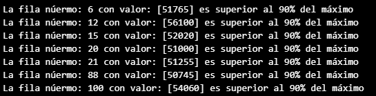
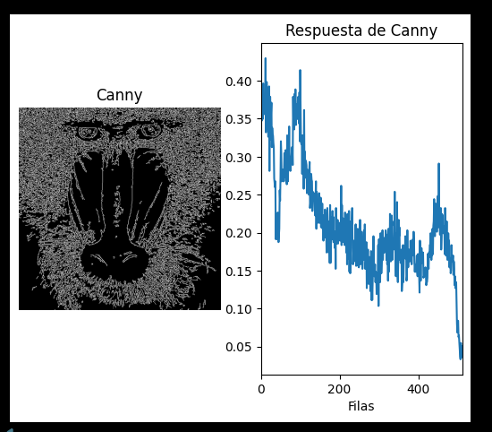
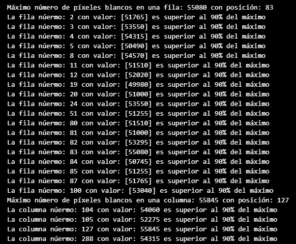
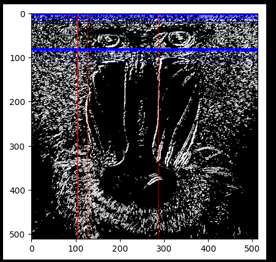
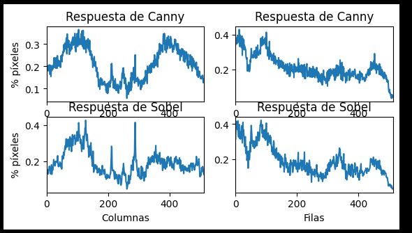

## Practica 2 Visión por Computador

### Contenidos

[Preparación](#preparación)  
[Contar píxeles blancos por filas Canny](#tarea-1-contar-píxeles-blancos-por-filas-canny)  
[Contar fila y columnas Sobel](#tarea-2-contar-fila-y-columnas-sobel)  
[Modos de imagen para presentar la asignatura](#tarea-3-modos-de-imagen-para-presentar-la-asignatura)  
[Procesamiento de imagen](#tarea-4-procesamiento-de-imagen)  


### Preparación

En esta práctica 2, la única preparación necesaria es importar las librerías cv2, numpy y matplotlib al inicio del cuaderno.

### Tarea 1: Contar píxeles blancos por filas Canny

Para la realización de esta tarea se optó primero por pasar la imágen original a escala de grises y apicarle el operador canny para poder obtener los contornos. Una vez realizado eso, se procederá a contar con un ```cv2.reduce``` cuantas filas hay luego se aplanaran con un ```flatten``` para obtener cada fila.

Una vez obtenidos ambos datos guardándolos en variables con dos funciones de numpy: ```np.max``` y ```np.argmax``` se podrán obtener cual es la fila que tiene más píxeles blancos y en que posición se encuentra.

.

El siguiente paso es mostrar todas las filas que superen un 90% del valor de la fila máxima. Para resolver esto, se usará un bucle for para cada fila comparando su núnero de pixeles con el de la fila máxima y este sería el resultado:

.

Para acabar la primera tarea se mostrará como en el ejemplo de las columnas, una gráfica que muestre la proporción de pixeles por fila:



### Tarea 2: Contar fila y columnas Sobel

La segunda tarea se basará en la anterior pero además de calcular el número de pixeles por fila, también se realizará por columnas pero en esta ocasión sobre una imagen a la que se le aplica el operador sobel, posteriormente se la convierte a 8 bits junto a un umbralizado el cual se decidió aplicarle un valor de 100.

Una vez obtenida la imágen se empiezan a contar las filas y columnas como en los ejemplos anteriores para obtener la máxima de ambas para poder luego comparar para obtener todas las filas y columnas por encima del 90% de las máximas lo que daría este resultado:

.

El siguiente paso es mostrar la imágen y mostrar sobre la misma las líneas para las filas y columnas que superan el umbral. Para poder hacerlo, cada vez que se obtienen dichas filas y columnas se aplica la siguiente línea de código ```cv2.line(sobel_color, (i, 0), (i, sobel_color.shape[0]-1), (255,0,0), 1)``` que pinta en la imágen de color rojo las columnas y de color azul las filas (depende de si son filas o columnas se cambia el color y el orden de la variale ```i``` y ```sobel_color```). 

Lo que acabaría dando un resultado como el siguiente:



Como último paso de esta tarea se propone comparar los resultados de Sobel y Canny por lo que se optó por utilizar gráficos en una cuadrícula 2x2 para mostrar tanto los píxeles por columnas y filas de cada transformación:



### Tarea 3: Modos de imagen para presentar la asignatura

La tarea número 3 propone mostrar diferentes imágenes para enseñar a alguien nuevo de que va la asignatura. Para ello se optó por utilizar 3 modos de cámara.

1. Un modo normal en el que la cámara se muestre sin ningúna variación. Lo único resaltable es que se añadió texto en la imágen (como se vió en la práctica 2) Que indique en que modo se encuentra gracias a ```cv2.putText()```.

2. Modo de escala de grises. Se transforma la imágen en escala de grises por medio de ```cv2.cvtColor()``` y también se le añade un texto para indicar el modo.

3. Modo bordes. Usando Canny como se aprendió en esta práctica podemos conseguir un efecto en el que se muestren únicamente los bordes resaltables en la cámara.

Para poder conseguir el cambio de modo se crea una variable modo que va rotando entre 3 parámetros al pulsar en el teclado la tecla "m".

### Tarea 4: Procesamiento de imagen


Saúl Expósito Morales
