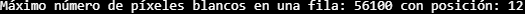

## Practica 1 Visión por Computador

### Contenidos

[Preparación](#preparación)  
[Tablero de ajedrez](#tarea-1-tablero-de-ajedrez)  
[Imagen estilo Mondrian](#tarea-2-imagen-estilo-mondrian)  
[Modificar el plano de una imágen](#tarea-3-modificar-el-plano-de-una-imagen)  
[Circulo zona mas clara y oscura](#tarea-4-círculo-zona-mas-clara-y-oscura)  
[Pop Art Personalizado](#tarea-5-pop-art-personalizado)  


### Preparación

En esta práctica 2, la única preparación necesaria es importar las librerías cv2, numpy y matplotlib al inicio del cuaderno.

### Tarea 1: Contar píxeles blancos por filas

Para la realización de esta tarea se optó primero por pasar la imágen original a escala de grises y apicarle el operador canny para poder obtener los contornos. Una vez realizado eso, se procederá a contar con un ```cv2.reduce``` cuantas filas hay luego se aplanaran con un ```flatten``` para obtener cada fila.

Una vez obtenidos ambos datos guardándolos en variables con dos funciones de numpy: ```np.max``` y ```np.argmax``` se podrán obtener cual es la fila que tiene más píxeles blancos y en que posición se encuentra.



### Tarea 2: Imagen estilo Mondrian

Para abordar esta propuesta se decidió dividir la tarea en 4 apartados:

- Rectángulos amarillos
- Rectángulos azules
- Rectángulos rojos
- Lines negras horizontales y verticales

Los cuales se iban pintando en la imágen pasaándole unas coordenadas concretas y establecioendo su color en rgb

### Tarea 3: Modificar el plano de una imagen

Gracias al código utilizado en el ejemplo propuesto en el cuaderno de la práctica, se decidió modifical el tercer plano de la imágen, el referente con la variable "b_img", indicando lo siguiente:

```
b_img = cv2.merge([b, r, r])
```

estableciendo tanto el canal verde como el rojo con tonos de rojo

### Tarea 4: Círculo zona mas clara y oscura

En esta ocasión se hizo uso de la IA para encontrar nuevas funciones de "cv2" con el objetivo de usarlas en esta tarea. Entre ellas encontramos las siguientes:

- ```gray = cv2.cvtColor(frame, cv2.COLOR_BGR2GRAY)``` Convertir la imágen obtenida a escala de grises para a partir de ella descubrir el pixel mas claro y más oscuro

- ```np.argmin(gray) / np.argmax(gray)``` Fevuelve el índice lineal del menor y mayor valor del array

- ```np.unravel_index(argmin/argmax, gray.shape)``` Lo transforma en coordenadas (fila, columna)

- ```cv2.circle``` Se le pasa la imagen guardada en la variable "frame" las coordenadas anteriormente obtenidas, el radio del circulo, el color y el grosor del mismo.

#### Subtarea 4: Zonas 8x8

Para ello la idea es hacer algo similar a lo anterior pero en esta ocasión ya no se podrán usar las funciones argmin y argmax.

Lo primero entonces será establecer el tamaño del bloque en el que se va a buscar en una variable "block_size".

Como antes se pasa la imágen a escala de grises y ahora se crearan además de las dos mismas variables de antes apra establecer las coordenadas de la zona mínima y máxima, otras dos auxiliares para ir comparando si son más o menos claras u oscuras.

Para ello se realizará un doble bucle for para saltar de 8 en 8 tanto vertical como horizontalmente y dentro de ese bloque obtener la media de los pixeles con np.mean y en caso de que sea mas claro o mas oscuro incluirlo en las variables auxiliares antes mencionadas

Para acabar se hacen los circulos de la misma manera que antes.

### Tarea 5: Pop Art Personalizado

A la hora de inventarme un pop art decidí buscar ejemplos por internet que me gustarán y una vez encontré algunas ideas intenté por medio de la IA descubrir como podría recrearlos.

Decidí hacer una viñeta de 2x3 imagenes con las siguientes características:

- Normal (la imágen sin tocarla)

- Cartoon: Mostrar la imágen con un filtro marcando las líneas de negro. Para ello tuve que utilizar tanto ```cv2.medianBlur(gray, 1)``` que elimina el ruido aplicandole un tamaño de kernel de 3 además de ```cv2.adaptiveThreshold(gray, 255, cv2.ADAPTIVE_THRESH_MEAN_C, cv2.THRESH_BINARY, 9, 9)``` que se encarga de generar la imágen con todos los bordes. Por último la combino con los bordes obtenidos anteriormente con ```cv2.bitwise_and(img, img, mask=edges)```
- Sketch: Parecido al anterior pero en blanco y negro estilo comic. Para ello convierto la imagen a escala de grises, invierto los colores claros y oscuros, le aplico un filtro con ```cv2.GaussianBlur(inv, (21,21), 0)``` y por último con ```cv2.divide(gray, 255-blur, scale=256)``` genero el efecto de dibujado a lapiz.

- Pixel Art: La técnica aqui es reducir a un tamaño pequeño la imagen y posteriormente volver a aumentarla al tamaño original pero sin suavizarla

- Halloween: Esta idea se me ocurrió por la fecha actual. Se basa en aplicar un filtro naranja a la vez que se crea una especie de mascara oscura al rededor de la imágen.

- Negativo: Invertir los colores de la imágen


Saúl Expósito Morales